- [Введение](#введение)
- [Выбор способа маршрутизации трафика](#выбор-способа-маршрутизации-трафика)
  - [Режим Router](#режим-router)
  - [Режим Simple](#режим-simple)
- [Подготовка сетевых интерфейсов](#подготовка-сетевых-интерфейсов)
- [Требования к оборудованию](#требования-к-оборудованию)
- [Настройка DNS](#настройка-dns)
- [Установка Сервера Авторизации в режиме Simple](#установка-сервера-авторизации-в-режиме-simple)
  - [Схема тестового стенда](#схема-тестового-стенда)
  - [Установка Сервера Авторизации из ova-шаблона](#установка-сервера-авторизации-из-ova-шаблона)
    - [Развертывание и предварительная настройка виртуальной машины Сервера Авторизации](#развертывание-и-предварительная-настройка-виртуальной-машины-сервера-авторизации)
    - [Настройка перенаправления трафика на Сервер Авторизации](#настройка-перенаправления-трафика-на-сервер-авторизации)
- [Установка Сервера Авторизации в режиме Router](#установка-сервера-авторизации-в-режиме-router)
  - [Схема тестового стенда](#схема-тестового-стенда-1)
  - [Установка Сервера Авторизации вручную](#установка-сервера-авторизации-вручную)
- [Настройка Сервера Авторизации](#настройка-сервера-авторизации)
- [Конфигурирование vGate](#конфигурирование-vgate)
- [Настройка резервного Сервера Авторизации](#настройка-резервного-сервера-авторизации)
- [Примеры настройки перенаправления трафика на Сервер Авторизации](#примеры-настройки-перенаправления-трафика-на-сервер-авторизации)
  - [Континент-4](#континент-4)
    - [Настройка в Менеджере конфигурации (МК)](#настройка-в-менеджере-конфигурации-мк)
      - [Добавление маршрута к зарегистрированному сетевому объекту ЦУС](#добавление-маршрута-к-зарегистрированному-сетевому-объекту-цус)
      - [Добавление маршрута к незарегистрированному сетевому объекту](#добавление-маршрута-к-незарегистрированному-сетевому-объекту)
      - [Сохранение изменений](#сохранение-изменений)
      - [Редактирование и удаление маршрутов в МК](#редактирование-и-удаление-маршрутов-в-мк)
    - [Настройка статических маршрутов при локальном управлении](#настройка-статических-маршрутов-при-локальном-управлении)
      - [Создание нового маршрута](#создание-нового-маршрута)
      - [Применение изменений](#применение-изменений)
  - [CISCO IOL](#cisco-iol)
  - [Linux iproute2](#linux-iproute2)
  - [PT NGFW](#pt-ngfw)
  - [Cisco Nexus (NX-OS)](#cisco-nexus-nx-os)
  - [Cisco ASA / Firepower (в режиме роутера)](#cisco-asa--firepower-в-режиме-роутера)
  - [HP ProCurve / ArubaOS-Switch](#hp-procurve--arubaos-switch)
  - [HP Comware (H3C)](#hp-comware-h3c)
  - [Juniper Junos](#juniper-junos)
  - [MikroTik RouterOS](#mikrotik-routeros)


---
# Введение

Данная инструкция предназначена для проведения пилотных проектов и носит ознакомительный характер. Рекомендуется ознакомиться с документацией решения vGate на сайте «Код Безопасности» [здесь](https://www.securitycode.ru/products/vgate/?tab=support).

Ниже приведен краткий сценарий развертывания и настройки ПО vGate.

1. **Ознакомьтесь с ограничениями использования продукта** в Release Notes:
   - [Release Notes vGate 5.2 (сертификат — сентябрь 2026)](https://docs.securitycode.ru/products/vgate_r2_5_2/AdminGuide%20-%20Operational/HardwareAndSoftwareRequirements/).
   - [Release Notes vGate 5.1 (сертифицирована)](https://www.securitycode.ru/upload/iblock/372/dml472f0ce9qmtxi2dixuircqf8vkatv/Release%20Notes.pdf)

2. **Ознакомьтесь с системными требованиями**:
   - [Системные требования vGate 5.2 (сертификат — сентябрь 2026)](https://www.securitycode.ru/upload/iblock/6e4/3auc6524w0w2p0xrmlej3jbvy166nra0/Release%20Notes.pdf).
   - [Системные требования vGate 5.1 (сертифицирована)](https://docs.securitycode.ru/products/vgate_r2_5_1/AdminGuide%20-%20Operational/HardwareAndSoftwareRequirements/)

3. **Выберите способ маршрутизации трафика**. Режим маршрутизации трафика напрямую не влияет на функции безопасности vGate. Режим маршрутизации трафика определяет принцип внедрения решения в существующую сеть:
   - с помощью сервера авторизации (Router Mode);
   - с помощью отдельного маршрутизатора (Simple Mode).

Трафик к защищаемым серверам из внешней сети администрирования должен идти **только через сервер авторизации vGate** (или через маршрутизатор с перенаправлением на vGate). Для этого необходимо настроить маршрутизацию сетевого трафика между рабочими местами администраторов и сетью, в которой размещаются защищаемые серверы и другие элементы виртуальной инфраструктуры.

[Примеры настройки перенаправления трафика на vGate на различных маршрутизаторах](#примеры-настройки-перенаправления-трафика-на-сервер-авторизации)

# Выбор способа маршрутизации трафика

## Режим Router

<figure style="text-align: center;">
  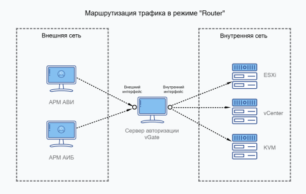
  <figcaption style="font-style: italic; color: #555; margin-top: 5px;">
    Схема маршрутизации в режиме Router
  </figcaption>
</figure>

**Условия и настройка:**

- Защищаемые серверы должны быть расположены в **отдельной подсети**.
- На всех защищаемых серверах в качестве **шлюза по умолчанию** следует указать IP-адрес сервера авторизации во **внутренней** сети администрирования.
- На всех рабочих местах АВИ в качестве **шлюза по умолчанию** следует указать IP-адрес сервера авторизации во **внешней** сети администрирования.

---

## Режим Simple

<figure style="text-align: center;">
  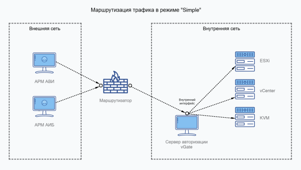
  <figcaption style="font-style: italic; color: #555; margin-top: 5px;">
    Схема маршрутизации в режиме Simple
  </figcaption>
</figure>

**Условия и настройка:**

- Данный режим рекомендуется использовать, если в сети уже есть **сертифицированный межсетевой экран (маршрутизатор)**, фильтрующий трафик к защищаемым серверам, и реконфигурация существующей сети не предполагается.
- Сервер авторизации размещается во **внутренней сети администрирования**, то есть в той же подсети, в которой размещены защищаемые серверы.
- В настройках маршрутизатора необходимо создать правила **перенаправления управляющего трафика** с рабочих мест АВИ и АИБ к защищаемым серверам через сервер авторизации vGate.

> **Подробнее:** см. раздел [Совместная работа с маршрутизатором](https://docs.securitycode.ru/products/vgate_r2_5_2/AdminGuide%20-%20Operational/OperationUsingRouter/).

> **Примечание:** Если vGate планируется использовать только в качестве межсетевого экрана (без функций СЗИ), маршрутизацию трафика рекомендуется настраивать в режиме Simple. Подробнее об особенностях конфигурации для данного случая см. в разделе [Развертывание vGate в качестве межсетевого экрана](https://docs.securitycode.ru/products/vgate_r2_5_2/AdminGuide%20-%20Operational/vGateAsFirewallOnly/).

# Подготовка сетевых интерфейсов

Порядок настройки сетевых интерфейсов различается в зависимости от выбранного режима и представлен в разделе **[Подготовка сетевых интерфейсов](https://docs.securitycode.ru/products/vgate_r2_5_2/AdminGuide%20-%20Operational/NetworkInterfaceSetupNew/)**.

**Рекомендуемые параметры**

До установки компонентов vGate необходимо выполнить конфигурирование сети, руководствуясь следующими правилами:

- **Внутренняя сеть администрирования** — сеть, в которой размещаются защищаемые серверы и другие элементы виртуальной инфраструктуры. Данную сеть рекомендуется отделить от сети виртуальных машин и других сетей виртуальной инфраструктуры.
- **Внешняя сеть администрирования** — сеть, в которой размещаются рабочие места АВИ и АИБ.
- **Сеть резервирования** — сеть, в которой расположен резервный сервер авторизации vGate.
- Если в виртуальной инфраструктуре используются функции **vMotion** и **Fault Tolerance**, рекомендуется организовать отдельную сеть репликации виртуальных машин, отделив ее от сетей администрирования и сетей виртуальных машин.
- Если данные виртуальных машин хранятся за пределами серверов виртуализации в отдельной системе хранения, рекомендуется создать сеть передачи данных на основе технологии **Ethernet (iSCSI)** или **Fibre Channel (FC)**. При необходимости сеть передачи данных и сеть репликации виртуальных машин могут быть совмещены.

# Требования к оборудованию

Для работы в сети, сконфигурированной таким образом, серверы виртуализации должны иметь необходимое число независимых Ethernet-интерфейсов.

> **Внимание!**  
> Не рекомендуется использование протокола **DHCP** для Ethernet-интерфейсов, подключенных к защищаемому периметру сети администрирования.

# Настройка DNS

При наличии DNS-сервера необходимо настроить **А-запись** в прямой и обратной зонах DNS с использованием **FQDN** основного сервера авторизации vGate.

В случае отсутствия DNS-сервера нужно сопоставить IPv4-адрес и FQDN основного сервера авторизации в файлах:

- **На рабочем месте АВИ с ОС Windows:**  
  `C:\Windows\system32\drivers\etc\hosts`

- **На сервере авторизации vGate (основном и резервном):**  
  `/etc/hosts`

> **Внимание!**  
> Доменному имени (FQDN) сервера авторизации vGate должен соответствовать **только один** IP-адрес.

Аналогично необходимо сопоставить IPv4-адреса и FQDN для всех защищаемых серверов (кроме автономных, если доступ к ним осуществляется без использования доменных имён).

> **Важно:**  
> Чтобы DNS-запросы для сопоставления FQDN и IP-адресов не блокировались ПО vGate, настройте взаимодействие с DNS-сервером **в обход сервера авторизации vGate**.

# Установка Сервера Авторизации в режиме Simple

## Схема тестового стенда

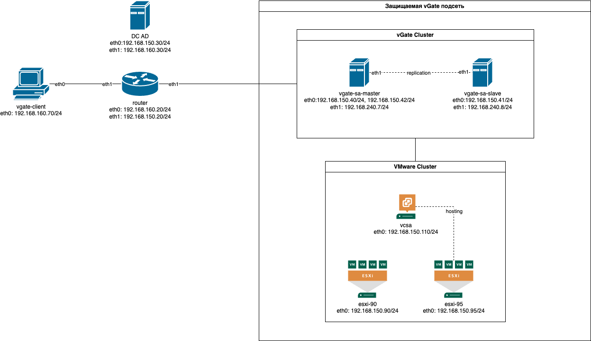

## Установка Сервера Авторизации из ova-шаблона

> Далее в качестве примера будет описан процесс развертывания виртуальной машины в среде виртуализации VMware vSphere.

### Развертывание и предварительная настройка виртуальной машины Сервера Авторизации

**1. Загружаем образ виртуальной машины по предоставленной вендором ссылке на компьютер.**

---

**2. Импортируем ova-шаблон в среду виртуализации**

<p align="center">
  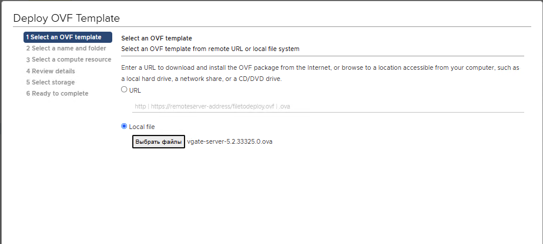
</p>

---

**3. Переходим в интерфейс виртуальной машины.**
Вводим учетные данные по умолчанию: **root / Qwerty`123**

---

**4. С помощью утилиты nmtui настраиваем сетевые интерфейсы согласно схеме. Отключаем ipv6. Указываем корректное имя хоста. В результате должна получиться следующая конфигурация:**

<p align="center">
  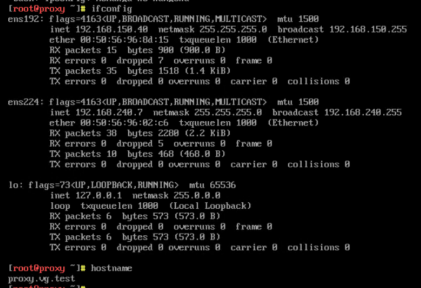
</p>

---

**5. Аналогичным образом настраиваем резервный сервер авторизации согласно схеме:**

<p align="center">
  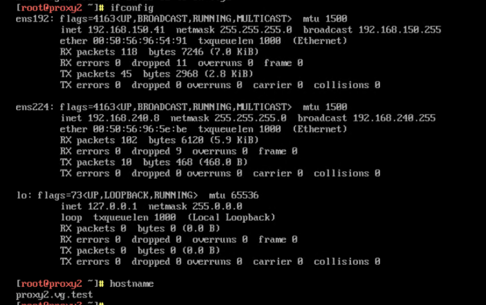
</p>

### Настройка перенаправления трафика на Сервер Авторизации

Перед настройкой Сервера Авторизации необходимо настроить перенаправление трафика к серверам из защищаемой подсети (`192.168.150.0/24`) через Сервер Авторизации vGate (`192.168.150.40/24`).
В данном примере в качестве маршрутизатора будет выступать машина `Router` с установленной ОС Ubuntu.

---

**1. Для маршрутизации трафика переходим на машину `Router` и настраиваем сетевые интерфейсы согласно схеме:**

<p align="center">
  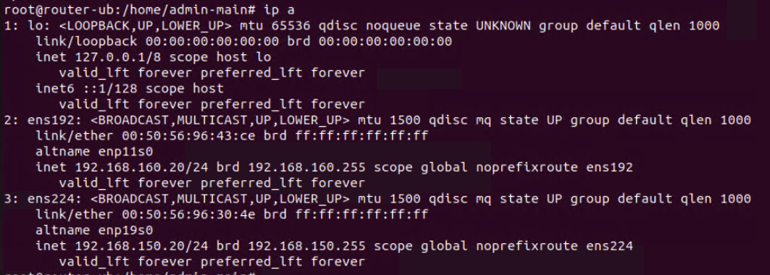
</p>

---

**2. Настраиваем роутинг на машине путем редактирования файла `/etc/sysctl.conf`, выставлением параметра `net.ipv4.ip_forward = 1`:**

<p align="center">
  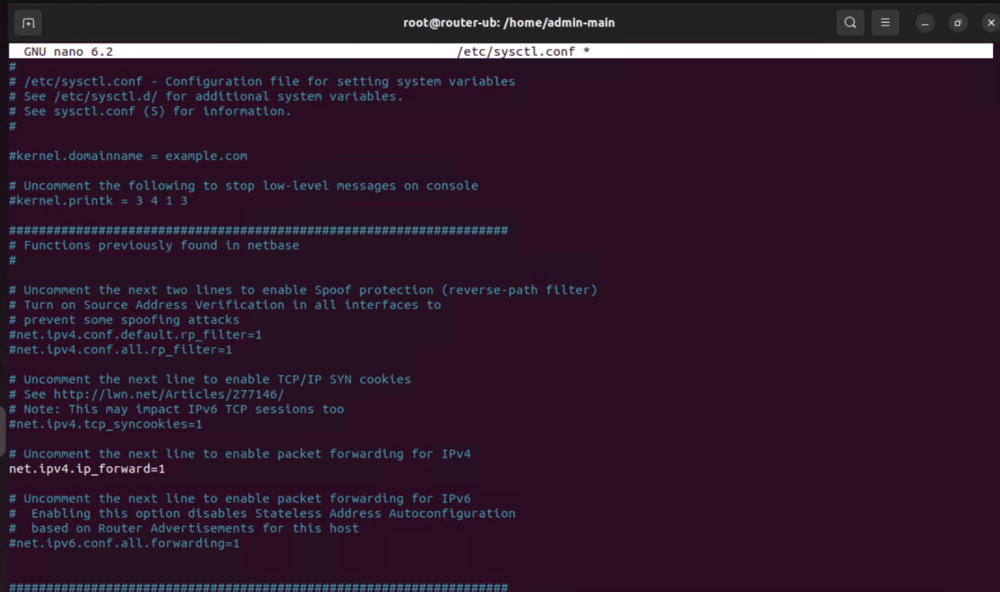
</p>

---

**3. Применяем изменения:**
  ```bash
   sudo sysctl -p
  ```
---

**4. Проверяем, что значение изменилось:**
```bash
cat /proc/sys/net/ipv4/ip_forward
```
<p align="center">
  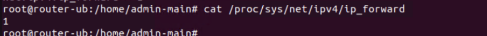
</p>

---

**5. Настраиваем перенаправление трафика на Сервер Авторизации путем выполнения следующих команд:**
   
```bash
ip route add <ip сервера из защищаемого периметра>/32 via <ip сервера авторизации vgate>
```
В нашем случае:

```bash
ip route add 192.168.150.95/32 via 192.168.150.40
```
---

**6. Проверяем, что трассировка с рабочего места АВИ `192.168.160.70` до защищаемого сервера идет через vGate:**

<p align="center">
  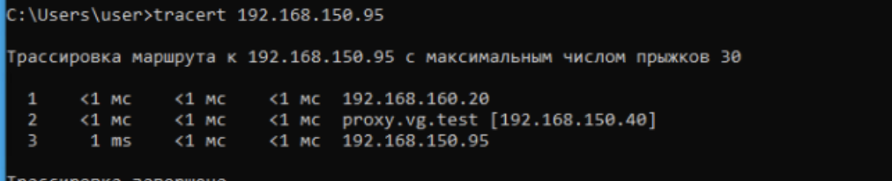
</p>

На этом предварительная настройка маршрутизатора завершена.
После этого необходимо перейти к шагам из раздела [Настройка Сервера Авторизации](#настройка-сервера-авторизации).

# Установка Сервера Авторизации в режиме Router

## Схема тестового стенда

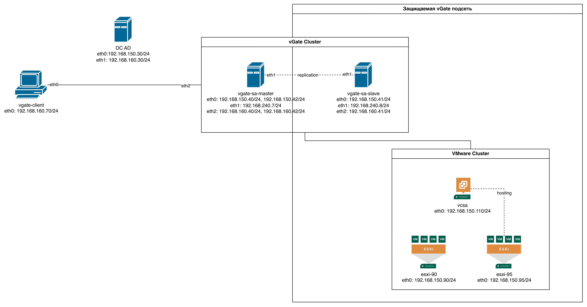

## Установка Сервера Авторизации вручную

> Рассмотрим установку Сервера Авторизации в режиме Router вручную, без использования ova-шаблона. Ознакомиться с системными требованиями можно здесь: [Системные требования vGate 5.2 (сертификат — сентябрь 2026)](https://www.securitycode.ru/upload/iblock/6e4/3auc6524w0w2p0xrmlej3jbvy166nra0/Release%20Notes.pdf). 

> Ниже будет рассмотрена установка на ОС **Astra Linux**.

> Переходим на машину **`vgate-master`** и выполняем следующие шаги:

**1. Отключаем NetworkManager. Настраиваем сетевые интерфейсы согласно схеме путем редактирования файлов `/etc/network/interfaces.d/*`. Указываем корректное имя хоста. В результате должна получиться следующая конфигурация:**

<p align="center">
  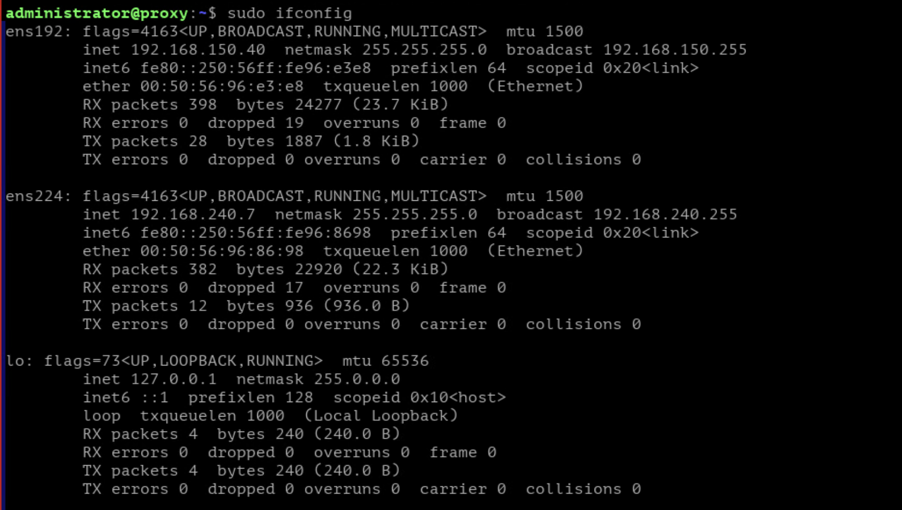
</p>

---

**2. Аналогичным образом настраиваем резервный сервер авторизации согласно схеме:**

<p align="center">
  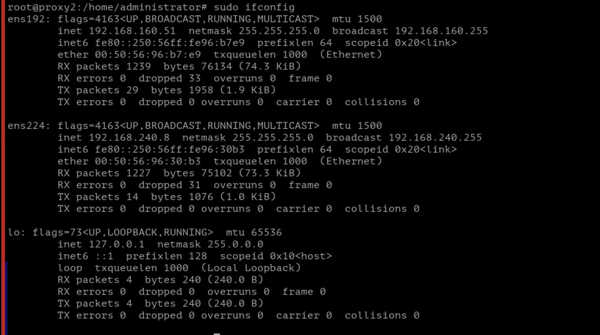
</p>

---

**3. На рабочем месте АВИ `192.168.160.70` указываем в качестве шлюза по умолчанию адрес vGate `192.168.160.40`:**

<p align="center">
  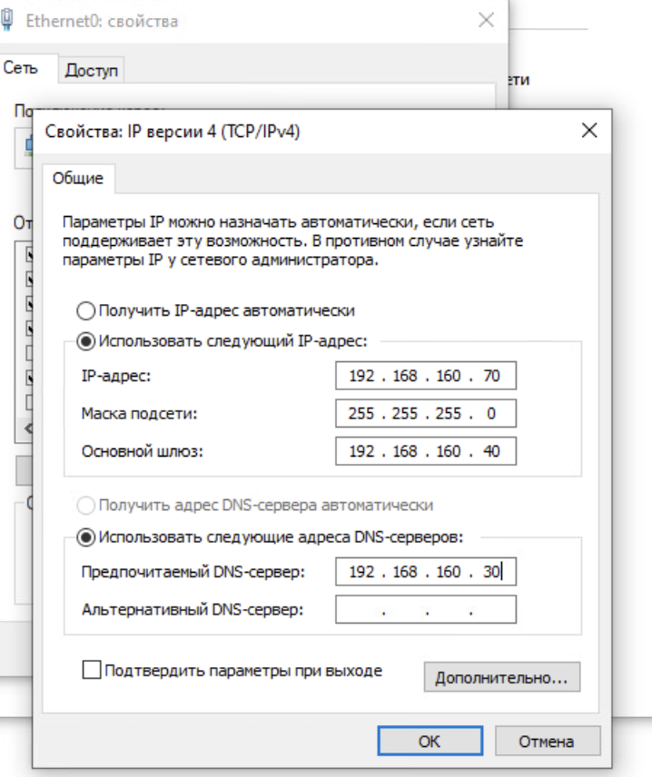
</p>

---

Переходим на основной сервер авторизации (`vgate-master`). Здесь мы должны установить необходимое программное обеспечение. С подробностями можно ознакомиться в разделе [Требуемое стороннее ПО](https://docs.securitycode.ru/products/vgate_r2_5_2/AdminGuide%20-%20Operational/RPMInstalling/).

---

**4. Устанавливаем пакеты `postgresql-contrib` и `postgresql`**

Команда для копирования:
```bash
apt install postgresql-contrib postgresql
```
<p align="center">
  
</p>

---

**5. Запускаем и добавляем в автозагрузку службу `postgresql` и проверяем, что служба в состоянии `active`**

Команды для копирования:
```bash
sudo systemctl start postgresql
sudo systemctl enable postgresql
systemctl status postgresql
```
<p align="center">
  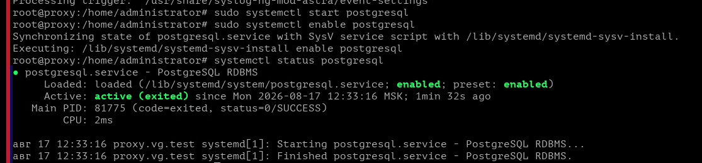
</p>

---

**6. Устанавливаем пакеты `krb5-kdc` `krb5-admin-server`**

Команда для копирования:
```bash
apt install krb5-kdc krb5-admin-server
```
<p align="center">
  
</p>
В появившемся окне настройки Kerberos нажимаем OK.
<p align="center">
  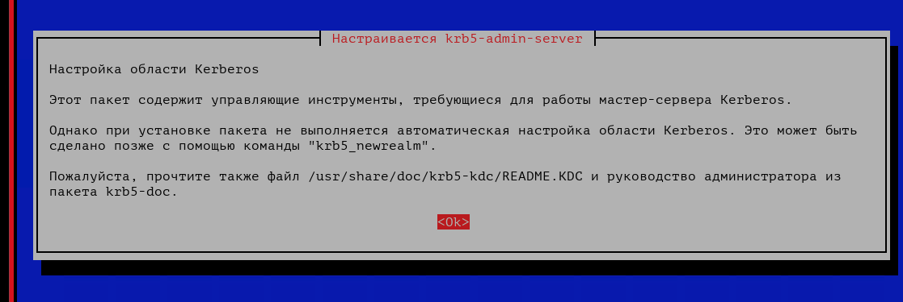
</p>

---
**7. Редактируем файл `/etc/krb5.conf` следующим образом:**

Содержимое файла для копирования:
```bash
[dbmodules]
db_library = db2
[libdefaults]
default_realm = DEFAULT.LOCAL
dns_lookup_kdc = false
dns_lookup_realm = false
noaddresses = yes
[logging]
admin_server = FILE:/var/log/kadmind.log
default = FILE:/var/log/krb5libs.log
kdc = FILE:/var/log/krb5kdc.log
[realms]
DEFAULT.LOCAL = {
database_name = /var/kerberos/krb5kdc/principal
kdc = localhost
}
```

<p align="center">
  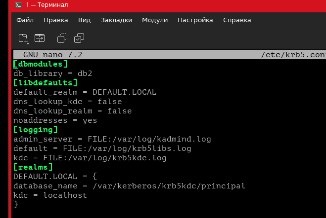
</p>

---
**8. Создаем каталог `/var/kerberos/krb5kdc`**

Команда для копирования:
```bash
mkdir -p /var/kerberos/krb5kdc
```
---
**9. Останавливаем службы `krb5-kdc` и `krb5-admin-server`**

Команды для копирования:
```bash
systemctl stop krb5-kdc
systemctl stop krb5-admin-server
```
<p align="center">
  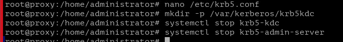
</p>

---
**10. Создаем домен по умолчанию и вводим пароль для хранения БД Kerberos:**

Команда для копирования:
```bash
kdb5_util create -s -r DEFAULT.LOCAL
```

<p align="center">
  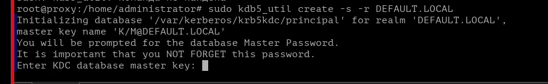
</p>

---
**11. Создаем файл `/etc/krb5kdc/kadm5.acl`**

Команда для копирования:
```bash
touch /etc/krb5kdc/kadm5.acl
```
<p align="center">
  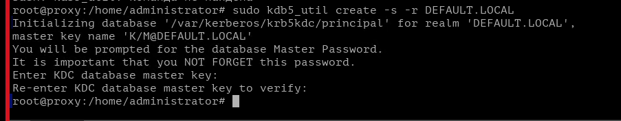
</p>

---

**12. Выполняем запуск служб `krb5-kdc` и `krb5-admin-server` и проверяем, что работа корректна**

Команда для копирования:
```bash
systemctl start krb5-kdc
systemctl start krb5-admin-server
systemctl status krb5-kdc
systemctl status krb5-admin-server
```

<p align="center">
  
</p>
<p align="center">
  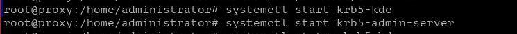
</p>
<p align="center">
  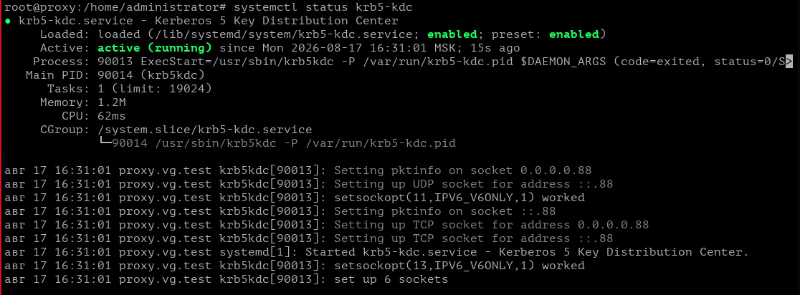
</p>

---
**13. Устанавливаем пакет keepalived**

Команда для копирования:
```bash
apt install keepalived
```
<p align="center">
  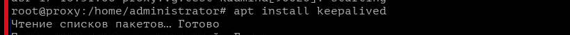
</p>

---

**14. Останавливаем службу `keepalived`:**

Команды для копирования:
```bash
systemctl stop keepalived
systemctl disable keepalived
```

<p align="center">
  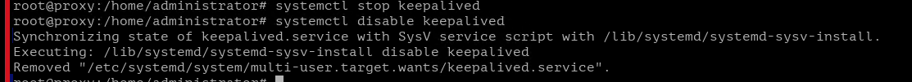
</p>

---

**15. Отключаем `ipv6` путем редактирования файла `/etc/default/grub`**

```bash
nano /etc/default/grub
```
<p align="center">
  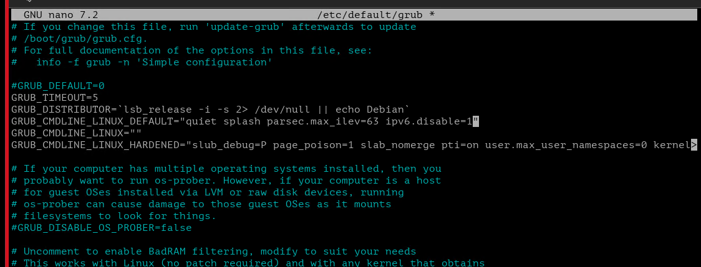
</p>

```bash
sudo update-grub
```
<p align="center">
  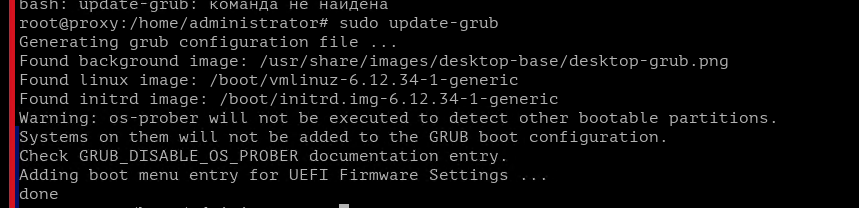
</p>

```bash
reboot
```

---

**16. Включаем параметр `net.ipv4.ip_forward=1` путем редактирования файла `/etc/sysctl.conf`**

<p align="center">
  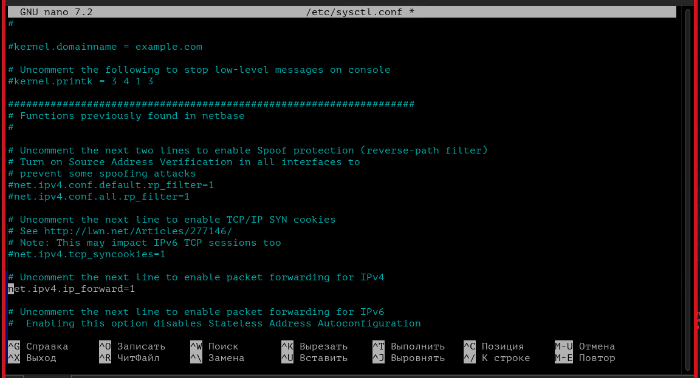
</p>

---

**17. Проверяем корректность выполненных настроек:**
```bash
cat /sys/module/ipv6/parameters/disable
cat /proc/sys/net/ipv4/ip_forward
```
<p align="center">
  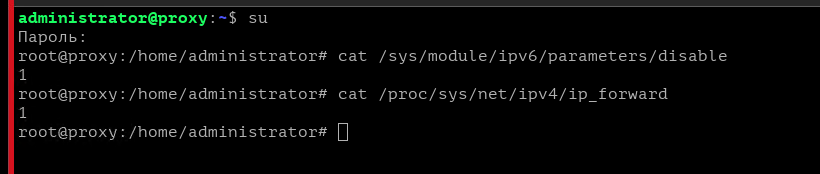
</p>

---

**18. Устанавливаем пакет Сервера Авторизации:**
```bash
dpkg -i /path/vgate-server-5.2.ххххх.х.x86_64.deb
```
<p align="center">
  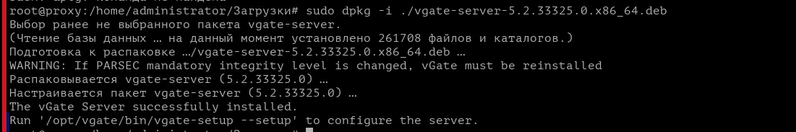
</p>

---

Установка Сервера Авторизации завершена. После этого необходимо перейти к шагам из раздела [Настройка Сервера Авторизации](#настройка-сервера-авторизации).

# Настройка Сервера Авторизации

Переходим в консоль машины `192.168.150.40` (`vgate-master`) и выполняем следующие шаги:

**1. Выполняем команду:**

`/opt/vgate/bin/vgate-setup --setup`

На экране появится меню настройки.

---

**2. Принимаем условия лицензионного соглашения:**

<p align="center">
  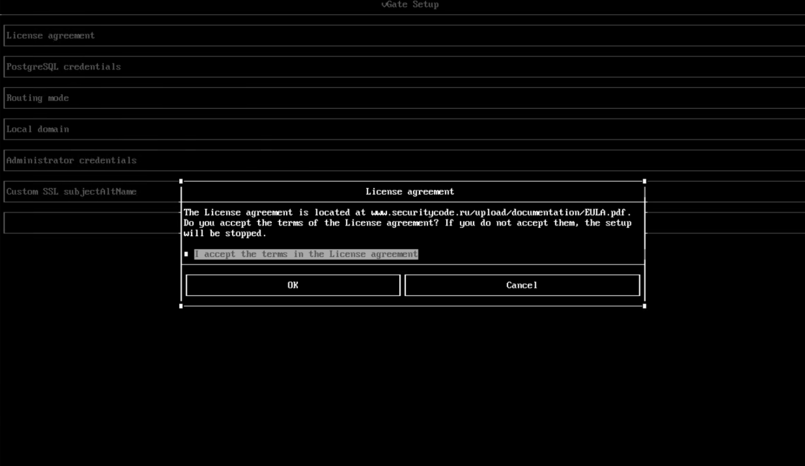
</p>

---

**3. Вводим учетные данные администратора PostgreSQL:**

<p align="center">
  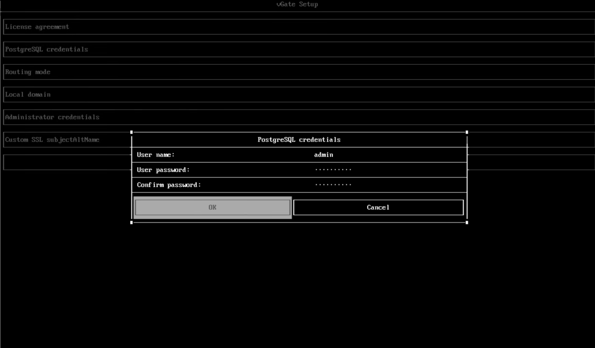
</p>

---

**4. Выбираем способ маршрутизации трафика:**

Для режима Simple:
<p align="center">
  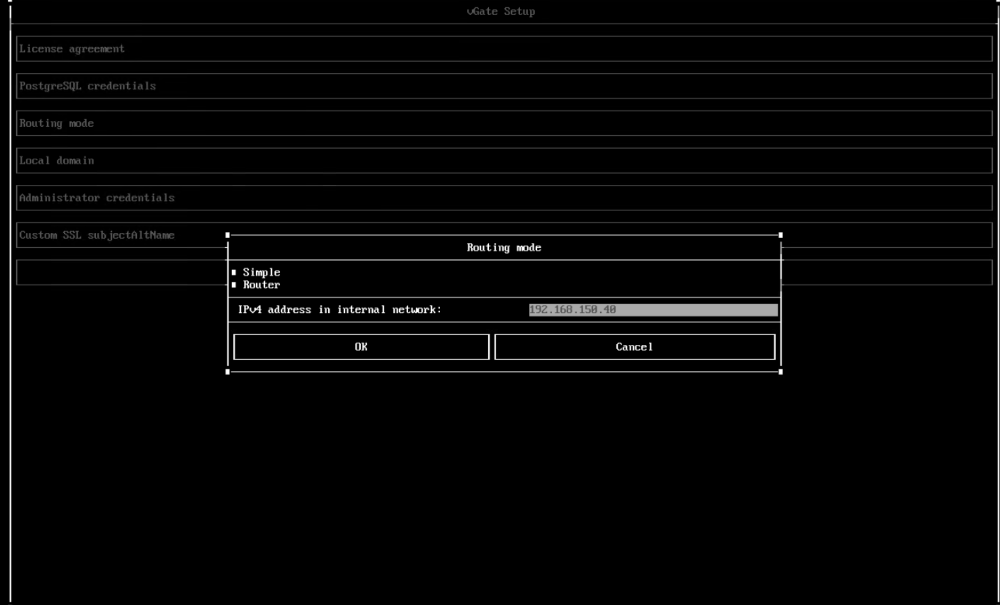
</p>

Для режима Router:
<p align="center">
  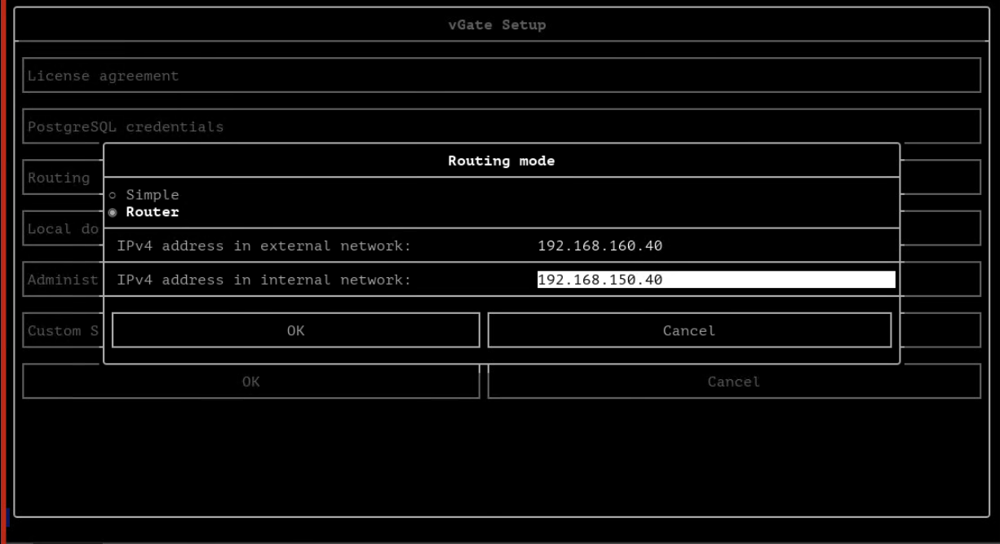
</p>

---

**5. Вводим имя локального домена. Для теста выберем название vgate:**

<p align="center">
  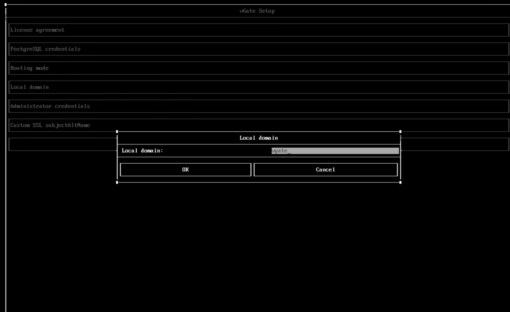
</p>

---

**6. Вводим учетные данные главного администратора ИБ:**

<p align="center">
  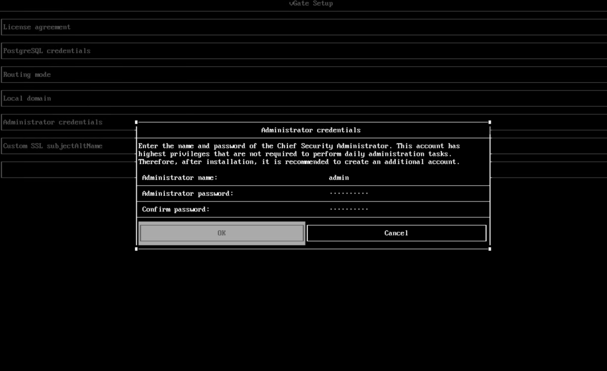
</p>

---

**7. Выбираем имя SSL-сертификата. Вводим `hostname` Сервера Авторизации:**

<p align="center">
  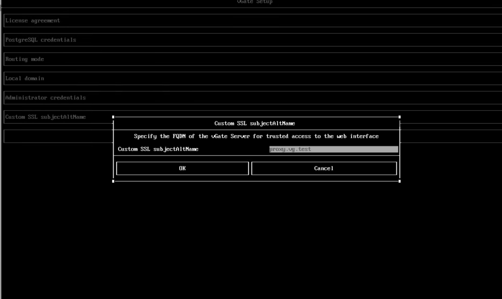
</p>

---

**8. Жмем OK:**

<p align="center">
  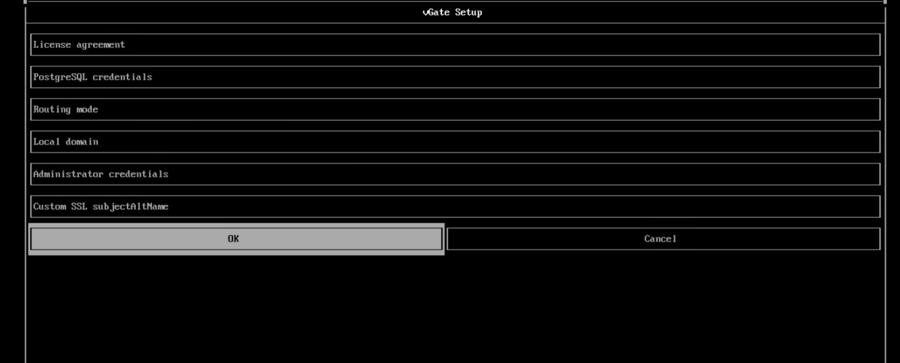
</p>

---

**9. Проверяем введенные настройки:**

<p align="center">
  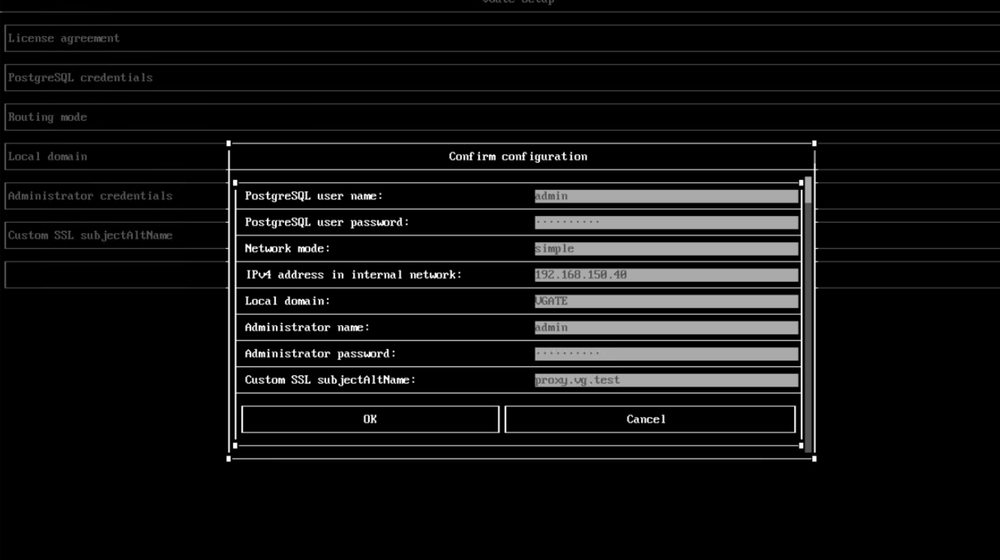
</p>

---

**10. Если настройки введены верно, нажимаем OK, и начнется настройка Сервера Авторизации:**

<p align="center">
  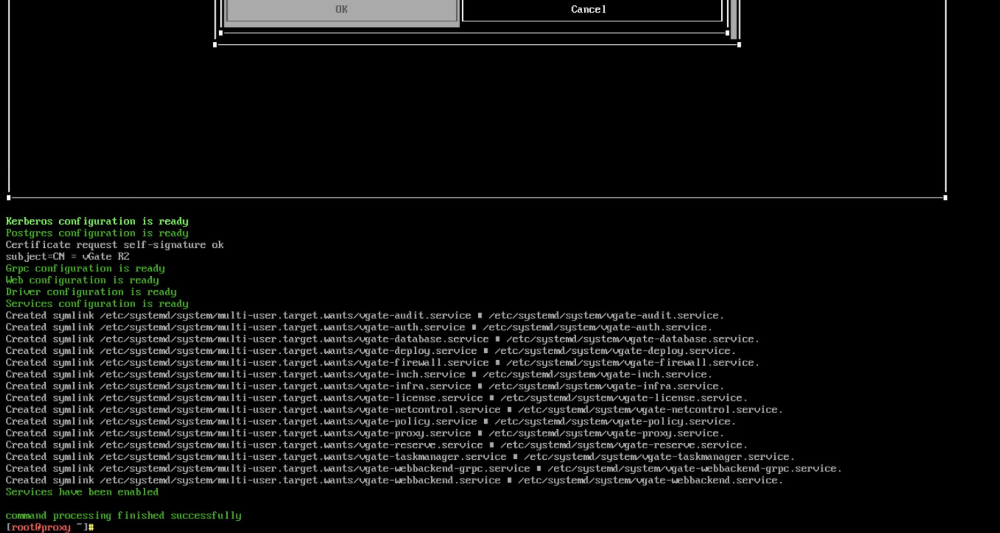
</p>

Настройка основного Сервера Авторизации завершена.

# Конфигурирование vGate

1. Переходим на машину `client`.
2. В браузере открываем страницу `https://<ip адрес или dns-имя сервера авторизации>`.
3. Вводим учетные данные главного АИБ, настроенные после запуска `/opt/vgate/bin/vgate-setup --setup`.
4. Загружаем файл лицензии, предоставленный вендором.

<p align="center">
  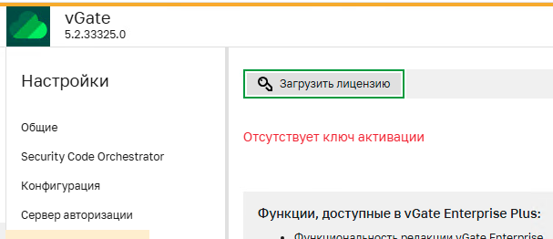
</p>

5. Далее последовательно выполняем настройку vGate. С планом конфигурирования можно ознакомиться в разделе [План настройки](https://docs.securitycode.ru/products/vgate_r2_5_2/AdminGuide%20-%20Operational/ConfigurationPlan/).

# Настройка резервного Сервера Авторизации

1. При установке vGate вручную (а не из ova-шаблона) на резервный Сервер Авторизации (`vgate-slave`) необходимо установить стороннее ПО, следуя шагам инструкции в разделе [Установка Сервера Авторизации вручную](#установка-сервера-авторизации-вручную). Для ova-шаблона этот шаг пропускается.
2. В веб-консоли vGate необходимо добавить сеть резервирования (`192.168.240.0/24`) в защищаемые подсети (раздел «Настройки» → «Защищаемые подсети»).

<p align="center">
  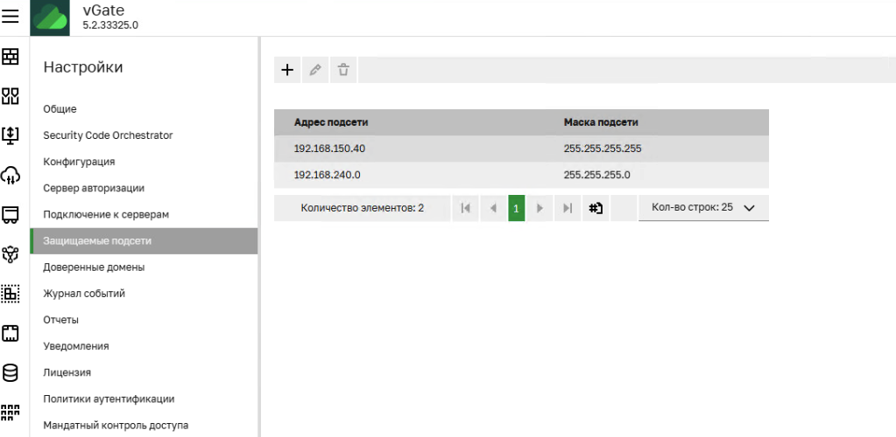
</p>

3. Переходим в раздел «Сервер Авторизации» и нажимаем на пиктограмму «плюс».
4. Вводим адрес резервного Сервера Авторизации в сети репликации и учетные данные пользователя `root`.

<p align="center">
  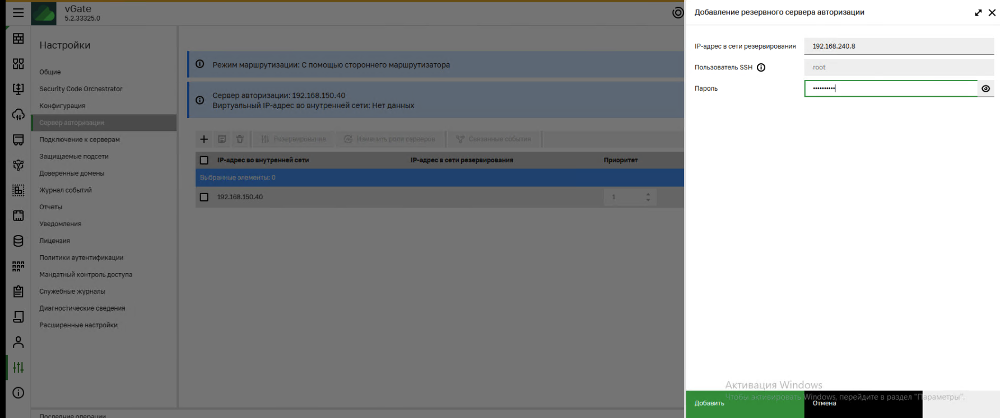
</p>

Нажимаем «Добавить». После этого операция добавления резервного Сервера Авторизации добавлена в очередь.

<p align="center">
  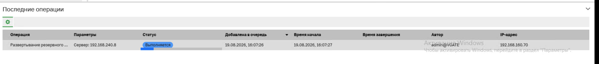
</p>

5. Необходимо убедиться, что резервный сервер добавлен и отображается на странице «Сервер Авторизации».

<p align="center">
  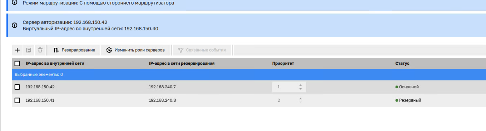
</p>

Развертывание резервного Сервера Авторизации завершено.

# Примеры настройки перенаправления трафика на Сервер Авторизации

Ниже приведены примеры настройки статических маршрутов на различных типах маршрутизаторов для перенаправления трафика к защищаемым серверам через Сервер Авторизации vGate.

## Континент-4

Подробная инструкция: [Создание маршрута в Континент-4](https://docs.securitycode.ru/products/kontinent_4_1_7/Topics_Continent/Network/StaticheskayaMarshrutizaciya/)

### Настройка в Менеджере конфигурации (МК)

1. В разделе «Структура» МК выберите нужный УБ и вызовите окно настройки свойств.
2. В левой части окна в разделе «Узел безопасности» выберите пункт «Статические маршруты». В правой части окна отобразится список статических маршрутов. Если настройка статической маршрутизации не выполнялась, список будет пустым.

#### Добавление маршрута к зарегистрированному сетевому объекту ЦУС

3. Нажмите на стрелку справа от кнопки «Добавить маршрут» и выберите пункт «Сетевой объект». Появится окно «Маршрут».
4. В поле «Назначение» нажмите на стрелку и выберите сетевой объект ЦУС. Укажите следующий узел по маршруту и введите метрику.

> **Примечание**  
> Для одного и того же сетевого объекта можно задать несколько маршрутов, в каждом из которых будет свой следующий узел. В случае недоступности указанного в маршруте следующего узла будет выбран другой маршрут. С помощью метрики задаются приоритеты маршрутов. Чем выше значение метрики, тем ниже приоритет маршрута. Высшему приоритету соответствует значение 0.

5. Нажмите кнопку «ОК». Маршрут будет добавлен в список.

#### Добавление маршрута к незарегистрированному сетевому объекту

6. Нажмите кнопку «Добавить маршрут». Появится окно «Маршрут».
7. Укажите IP-адрес объекта назначения, следующий узел по маршруту и метрику (см. примечание выше). Нажмите кнопку «ОК». Список дополнится строкой нового маршрута.

#### Сохранение изменений

8. После проведения всех необходимых настроек сохраните изменения в конфигурации ЦУС и установите политику на компоненты комплекса с измененными параметрами.

#### Редактирование и удаление маршрутов в МК

1. В разделе «Структура» МК выберите нужный УБ и вызовите окно настройки свойств.
2. В левой части окна в разделе «Узел безопасности» выберите пункт «Статические маршруты».
3. Для изменения маршрута нажмите кнопку редактирования, внесите изменения в появившемся окне и нажмите «ОК».
4. Для удаления записи выберите нужную строку и нажмите кнопку удаления. Выбранная запись будет удалена.
5. Сохраните изменения в конфигурации ЦУС и установите политику на компоненты комплекса.

### Настройка статических маршрутов при локальном управлении

1. В меню настроек выберите пункт «Сеть» и нажмите `Enter`. Появится окно «Сетевые настройки».
2. Выберите пункт «Статические маршруты» и нажмите `Enter`. Появится окно «Статические маршруты».

#### Создание нового маршрута

3. Нажмите клавишу `n` для создания нового маршрута.

> **Примечание**  
> Для редактирования имеющегося маршрута выберите его в списке и нажмите `Enter`, для удаления – `Del`.

Появится окно «Новый маршрут».

4. Введите IP-адрес удаленного сетевого объекта, укажите шлюз и введите метрику (см. примечание выше). Нажмите `Enter`. При доступности шлюза маршрут будет создан, и вы вернетесь в окно «Статические маршруты». При необходимости добавления других маршрутов повторите пп. 3–4.

#### Применение изменений

5. Для применения новых параметров вернитесь в меню настроек, выберите пункт «Применить локальную политику» и нажмите `Enter`.

> **Примечание**  
> При изменении локальной конфигурации достаточно одного применения локальной политики после выполнения всех настроек.

6. Дождитесь завершения операции и подтвердите изменения на ЦУС локально или средствами МК.

## CISCO IOL

```bash
ip route <ip сервера из защищаемого периметра> 255.255.255.255 <ip сервера авторизации vgate>
```

## Linux iproute2

```bash
ip route add <ip сервера из защищаемого периметра>/32 via <ip сервера авторизации vgate>
```

## PT NGFW

С помощью веб-консоли выполните следующие шаги:

1. В главном меню выберите «Устройства».
2. Выберите устройство, для которого вы хотите добавить маршрут.
3. Выберите вкладку «Виртуальные контексты».
4. Нажмите на название виртуального контекста, для которого вы хотите добавить маршрут.
5. Выберите вкладку «Виртуальные роутеры».
6. Выберите виртуальный роутер, для которого вы хотите добавить маршрут.
7. Выберите вкладку «Статические маршруты».
8. Нажмите «Добавить маршрут».

<p align="center">
  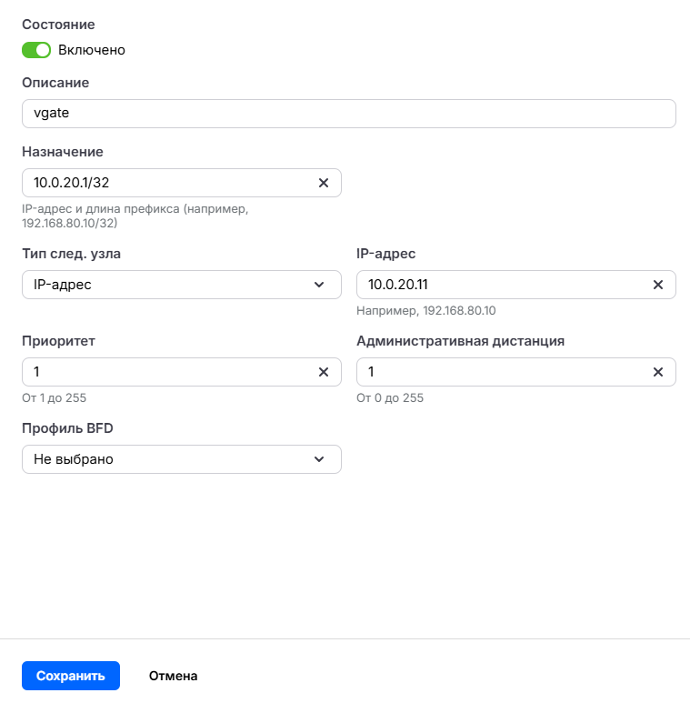
</p>

## Cisco Nexus (NX-OS)

```bash
ip route <ip сервера из защищаемого периметра>/32 <ip сервера авторизации vgate>
```

## Cisco ASA / Firepower (в режиме роутера)

```bash
route inside <ip сервера из защищаемого периметра> 255.255.255.255 <ip сервера авторизации vgate>
```

## HP ProCurve / ArubaOS-Switch

```bash 
ip route <ip сервера из защищаемого периметра> 255.255.255.255 <ip сервера авторизации vgate>
```

## HP Comware (H3C)

```bash
ip route-static <ip сервера из защищаемого периметра> 32 <ip сервера авторизации vgate>
```

## Juniper Junos

```bash
set routing-options static route <ip сервера из защищаемого периметра>/32 next-hop <ip сервера авторизации vgate>
```

## MikroTik RouterOS

```bash
/ip route add dst-address=<ip сервера из защищаемого периметра>/32 gateway=<ip сервера авторизации vgate>
```